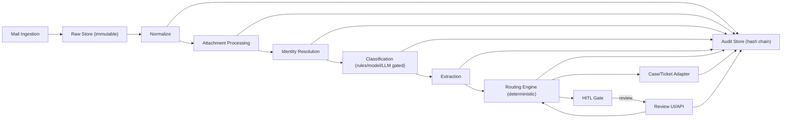

# Insurance Email Input Manager (IEIM) - SSOT Pack v1.0.2

This repository is a **Single Source of Truth (SSOT) pack** for building an Insurance Email Input Manager (IEIM) as a production system. It combines specifications, schemas, configs, tests, and runbooks into a phase-by-phase delivery plan with binding quality gates.

IEIM's objective is to turn inbound insurance emails (including attachments) into **auditable, deterministic operational outcomes**:
ingest -> normalize -> attachment processing -> identity resolution -> classify/extract -> deterministic routing -> case/ticket actions -> HITL review (when needed) -> immutable audit log.

## What this pack is (and is not)

- This is an **implementation handoff pack**: stable contracts, canonical labels/IDs, rulesets, and verification to build against.
- This repository includes a **reference implementation** (Python) to execute the phases and validate the contracts and gates.
- This is not a hosted SaaS. You deploy it in your own environment (Compose or Kubernetes/Helm).

## Architecture

High-level pipeline and integration boundaries:



Details: `spec/02_ARCHITECTURE.md`

## Design principles (product and compliance)

- **Fail-closed by default**: uncertainty routes to review or request-info drafts.
- **Immutability**: raw MIME/attachments are append-only; audit events are append-only with a hash chain.
- **Determinism mode**: reproducible decisions; decision hashes are timestamp-free.
- **Single Definition Rule**: canonical labels/IDs are defined only in `spec/00_CANONICAL.md`.
- **Human-in-the-loop (HITL)**: reviewer actions are stored as versioned correction records and audited.

## Repository map (where to look)

- SSOT and labels: `spec/00_CANONICAL.md`
- Scope and requirements: `spec/01_SCOPE.md`
- Phase plan and gates: `spec/09_PHASE_PLAN.md` and `QUALITY_GATES.md`
- Enterprise-ready roadmap (P9+): `spec/13_ENTERPRISE_PHASE_PLAN_P9_PLUS.md`
- Enterprise defaults (P9+): `spec/14_ENTERPRISE_DEFAULTS.md`
- Contracts (JSON Schemas): `schemas/`
- Interfaces (adapters and HITL): `interfaces/`
- Prompts and strict JSON contracts: `prompts/`
- Runbooks: `runbooks/` and `spec/11_OPERATIONS_RUNBOOK.md`
- Reference implementation: `ieim/` and `ieimctl.py`
- Verification scripts: `scripts/`
- Sample corpus + gold expectations: `data/samples/`

## Quickstart (verification)

From the repo root:

```bash
bash scripts/verify_pack.sh
python -B -m unittest discover -s tests -p "test_*.py"
```

The CLI also exposes:

```bash
python ieimctl.py pack verify
```

## Install

- Docker Compose: `docs/INSTALL_COMPOSE.md`
- Kubernetes/Helm: `docs/INSTALL_HELM.md`
- Upgrade guidance: `docs/UPGRADE.md`

## Releases (installable artifacts)

Each GitHub Release publishes:

- Helm chart package (`ieim-<version>.tgz`)
- SBOMs (SPDX JSON) for the published container images
- Signed provenance (`provenance.json` + `provenance.sig` + `provenance.crt`)

Release container images are published to GHCR:

- `ghcr.io/<owner>/ieim-api:<version>`
- `ghcr.io/<owner>/ieim-worker:<version>`
- `ghcr.io/<owner>/ieim-scheduler:<version>`

Details and verification: `docs/RELEASES.md`

## LLM usage (policy-gated)

LLM calls are optional, are gated to preserve safety and reproducibility, and are disabled by default.

Details: `spec/05_CLASSIFICATION_AND_LLM.md`

## License

Apache-2.0 (see `LICENSE`).
