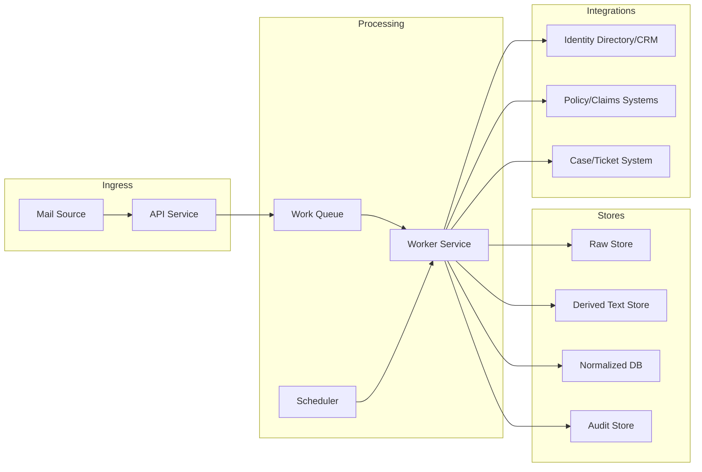
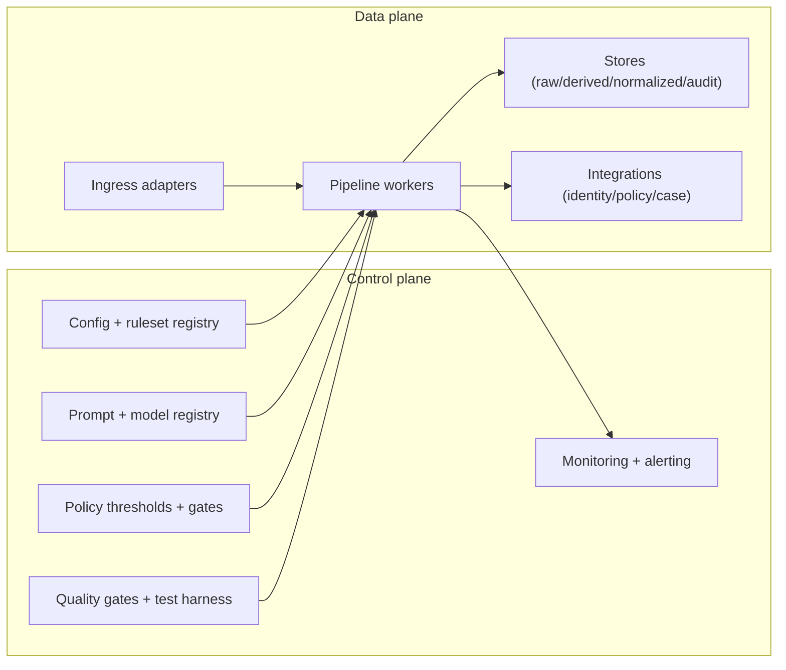

# Architecture

This section describes IEIM's logical and physical architecture, including data stores and integration points. Canonical IDs, labels, and paths are defined in `spec/00_CANONICAL.md`.

## End-to-end flow (logical)

```mermaid
flowchart TB
  %% Ingress + preservation
  subgraph S0["Ingress + Preservation"]
    A["Mail connectors: M365/IMAP/SMTP"] --> B["Dedupe + idempotent intake"]
    B --> C["Raw Store (append-only MIME + attachments)"]
    B -->|schemas/audit_event.schema.json| D["Audit: INGEST event (hash chain)"]
  end

  %% Normalization + content prep
  subgraph S1["Normalize + Content Prep"]
    C --> E["Normalize MIME: headers, thread, lang, metadata"]
    E -->|schemas/normalized_message.schema.json| F["Attachment pipeline: AV, type detect, OCR/extract"]
    F -->|schemas/attachment_artifact.schema.json| G["Text assembly: body + attachments + redaction map"]
    E -->|schemas/audit_event.schema.json| H["Audit: NORMALIZE event"]
    F -->|schemas/audit_event.schema.json| I["Audit: ATTACHMENT event"]
    G -->|schemas/audit_event.schema.json| J["Audit: CONTENT event"]
  end

  %% Intelligence gates
  subgraph S2["Identity + Intelligence Gates"]
    G --> K["Identity candidates + deterministic scoring"]
    K --> L{ "LLM allowed?" }
    L -->|no / determinism| M["Rule + model classify"]
    L -->|yes| N["LLM classify (strict JSON)"]
    N --> O["LLM result cache (fingerprint)"]
    K -->|schemas/identity_resolution_result.schema.json| L
    M -->|schemas/classification_result.schema.json| P["Classification result"]
    N -->|schemas/classification_result.schema.json| P
    P --> Q["Entity extraction + validation + provenance"]
    Q -->|schemas/extraction_result.schema.json| U["Routing decision (deterministic tables)"]
    K -->|schemas/audit_event.schema.json| R["Audit: IDENTITY event"]
    P -->|schemas/audit_event.schema.json| S["Audit: CLASSIFY event"]
    Q -->|schemas/audit_event.schema.json| T["Audit: EXTRACT event"]
  end

  %% Decisions + human loop
  subgraph S3["Routing + Human Review"]
    U --> V{ "HITL required?" }
    V -->|yes| W["Review UI/API + corrections"]
    W --> U
    U -->|schemas/routing_decision.schema.json| X["Case/Ticket adapter (idempotent)"]
    X --> Y["Downstream systems: claims/policy/case"]
    U -->|schemas/audit_event.schema.json| Z["Audit: ROUTE event"]
    W -->|schemas/audit_event.schema.json| AA["Audit: REVIEW event"]
    X -->|schemas/audit_event.schema.json| AB["Audit: ADAPTER event"]
  end

  %% Security overlays
  subgraph S4["Security + Compliance Overlays"]
    G --> AC["Redaction/minimization gateway (LLM)"]
    F --> AD["Malware + DLP checks"]
    AD --> AE["Risk flags (fraud/legal/self-harm)"]
  end

  %% Gate behavior
  AE --> V
  AC --> N
```

## Failure and edge-case path (logical)

```mermaid
flowchart TB
  A["Any stage output"] --> B{ "Schema valid?" }
  B -->|no| C["Fail-closed: route to HITL review"]
  B -->|yes| D{ "Risk flag raised?" }
  D -->|yes| C
  D -->|no| E{ "Identity ambiguous?" }
  E -->|yes| C
  E -->|no| F{ "LLM output valid + above confidence?" }
  F -->|no| G["Fallback to deterministic rules"]
  G --> H{ "Deterministic confidence high?" }
  H -->|no| C
  H -->|yes| I["Proceed to routing"]
  F -->|yes| I
  C --> J["Review UI/API: corrections + approvals"]
  J --> I
  I --> K["Audit: failure/override reason + evidence span"]
```

## Runtime view (services + data paths)



## Control-plane vs data-plane (logical)



## Component model

The system is decomposed into services and adapters. The module identifiers used for traceability are listed in `spec/00_CANONICAL.md`.

### Core services

| Service | Responsibilities | Notes |
|---|---|---|
| Ingestion service | Connectors for M365 Graph, IMAP, SMTP gateway; idempotent intake | At-least-once + dedupe |
| Raw store service | Append-only storage of MIME and attachment bytes | Never overwrite |
| Normalization service | MIME parsing, canonicalization, language detection, thread metadata | Produces NormalizedMessage |
| Attachment service | AV scan, file type detect, text extract, OCR | Produces AttachmentArtifact |
| Identity service | Candidate retrieval + deterministic scoring + Top-K + evidence | Fail-closed |
| Classification service | Rules -> lightweight model -> LLM (gated) | Strict JSON outputs |
| Extraction service | Entities + provenance + validation | High-impact entities gate |
| Routing service | Deterministic decision tables + hard overrides | Versioned rulesets |
| Case adapter service | Create/update cases, attach original email/files, add drafts | Idempotent keys |
| Audit logger | Append-only audit events + hash chain | Tamper-evident |
| Review UI/API | Human review, corrections, approvals | RBAC-gated |

### Stores

| Store | Contents | Immutability |
|---|---|---|
| Object storage (raw) | MIME and attachment bytes | Append-only (no overwrite) |
| Object storage (derived) | Extracted text artifacts and OCR output | Append-only, versioned by hashes |
| Normalized DB | NormalizedMessage and derived results | Mutable via versioned records; never rewrite raw |
| Audit store | AuditEvent append-only events with hash chain | Append-only |
| Cache | LLM result cache keyed by fingerprints and versions | TTL-based |

## Data contracts by stage

Each stage reads a schema-validated artifact and writes a schema-validated artifact. All outputs are immutable and hash-addressed.

| Stage | Input | Output | Schema |
|---|---|---|---|
| INGEST | raw MIME + attachments | raw artifacts + ingest metadata | `schemas/normalized_message.schema.json` (metadata) |
| NORMALIZE | raw MIME | NormalizedMessage | `schemas/normalized_message.schema.json` |
| ATTACHMENTS | attachments | AttachmentArtifact(s) | `schemas/attachment_artifact.schema.json` |
| IDENTITY | NormalizedMessage + text artifacts | IdentityResolutionResult | `schemas/identity_resolution_result.schema.json` |
| CLASSIFY | NormalizedMessage + identity context | ClassificationResult | `schemas/classification_result.schema.json` |
| EXTRACT | NormalizedMessage + attachments | ExtractionResult | `schemas/extraction_result.schema.json` |
| ROUTE | identity + classification | RoutingDecision | `schemas/routing_decision.schema.json` |
| AUDIT | stage input/output refs | AuditEvent | `schemas/audit_event.schema.json` |

## Determinism and reproducibility

- Determinism mode disables LLM calls and produces timestamp-free decision hashes.
- All decisions include config hash, ruleset version, and prompt/model versions where applicable.
- Reprocessing uses pinned artifacts; if any artifact is missing, it fails closed to review.

## Failure and safety gates

- Risk flags (malware, legal, regulatory, fraud, self-harm) override routing before normal rules.
- If identity cannot be confirmed or is ambiguous, route to review and generate a minimal request-for-info draft.
- If LLM output fails schema validation or confidence thresholds, the system fails closed to review or falls back to deterministic rules.

## Deployment variants

### On-prem
- All services and stores run within a controlled network zone.
- LLM use is either disabled or served by an on-prem model endpoint.

### Hybrid (recommended)
- Core pipeline and storage remain on-prem/private cloud.
- External LLM is optional and only enabled through a redaction/minimization gateway.

### Cloud
- Fully hosted in a single-tenant environment with private networking, customer-managed keys, and strict DLP.

Recommendation rationale: hybrid provides the best balance of compliance, model quality, and operational scalability while preserving a deterministic and review-safe fallback.

## Integration boundaries

- Mail ingestion adapter boundary: `interfaces/mail_ingest_adapter.md`
- Case/ticket system adapter boundary: `interfaces/case_system_adapter.md`
- Optional DMS/ECM adapter boundary: `interfaces/dms_adapter.md`

## Backpressure and failure handling

- The pipeline is event-driven. Each stage emits an audit event and produces a persisted output before acknowledging upstream work.
- When dependencies are unavailable, the system must either retry within policy or fail closed to a review queue.
